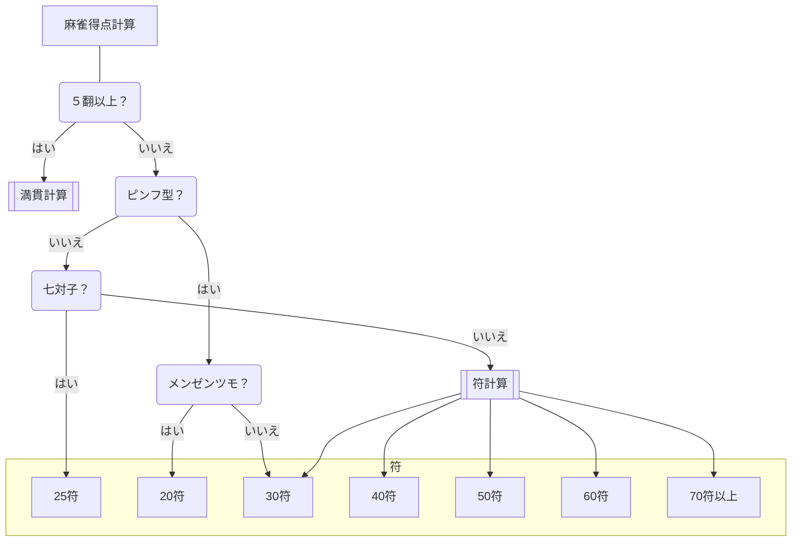

```mermaid
graph TD;
    S["麻雀得点計算"] --- Q1
    Q1("５翻以上？") -->|"はい"| M[["満貫計算"]]
    Q1 -->|"いいえ"| Q2
    Q2("ピンフ型？") -->|"はい"| P_Q1
    Q2 -->|"いいえ"| Q3
    Q3("七対子？" )-->|"はい"| 25FU
    Q3 -->|"いいえ"| FC
    P_Q1("メンゼンツモ？" )-->|"はい"| 20FU
    P_Q1 -->|"いいえ"| 30FU
    FC[["符計算"]] --> 30FU & 40FU & 50FU & 60FU & 70FUover
    subgraph F ["符"]
        20FU["20符"]
        25FU["25符"]
        30FU["30符"]
        40FU["40符"]
        50FU["50符"]
        60FU["60符"]
        70FUover["70符以上"]
    end
```
