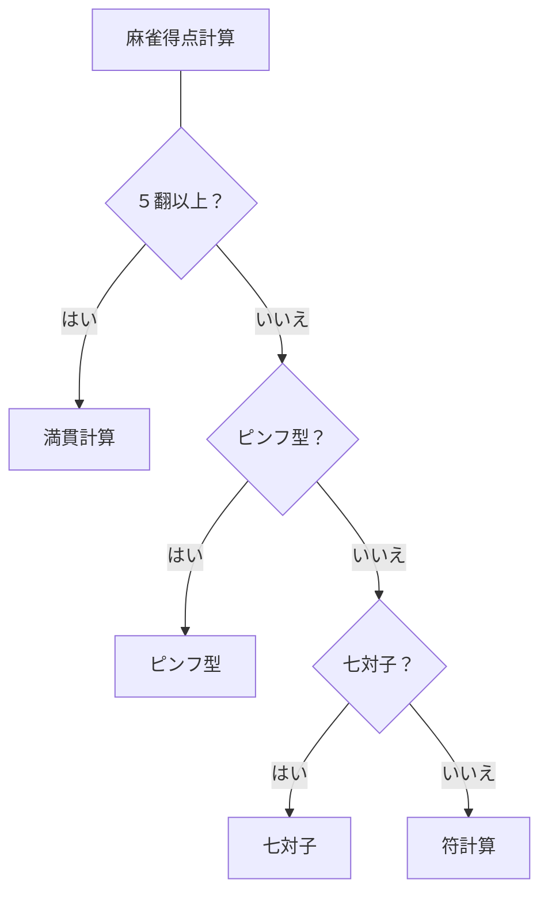

```mermaid
graph TD;
    S["麻雀得点計算"] --- Q1{"５翻以上？"};
    Q1 -->|"はい"| M["満貫計算"];
    Q1 -->|"いいえ"| Q2{"ピンフ型？"};
    Q2 -->|"はい"| P["ピンフ型"];
    Q2 -->|"いいえ"| Q3{"七対子？"};
    Q3 -->|"はい"| SP["七対子"];
    Q3 -->|"いいえ"| F["符計算"]
```
