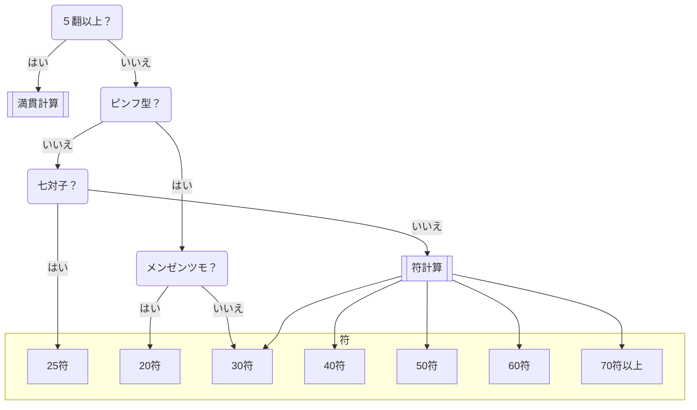

# チャート式麻雀得点計算

## 計算チャート

ピンフ型
: 面前ならピンフになるかたち。鳴いていても該当する。

## 満貫計算

| 満貫(~5翻)  | 跳満(6,7翻)  | 倍満(8~10翻) | 三倍満(11,12翻) | 役満(13翻~)  |
| ---------  | ----------- | ----------- | -------------- | ----------- |
| 8000/12000 | 12000/18000 | 16000/24000 | 24000/36000    | 32000/48000 |

表記は、子の点数/親の点数。

子のツモは1/2で親払い、1/4で子払い。親のツモは1/3で子払い。

| Priority apples | Second priority | Third priority |
|-------|--------|---------|
| ambrosia | gala | red delicious |
| pink lady | jazz | macintosh |
| honeycrisp | granny smith | fuji |

